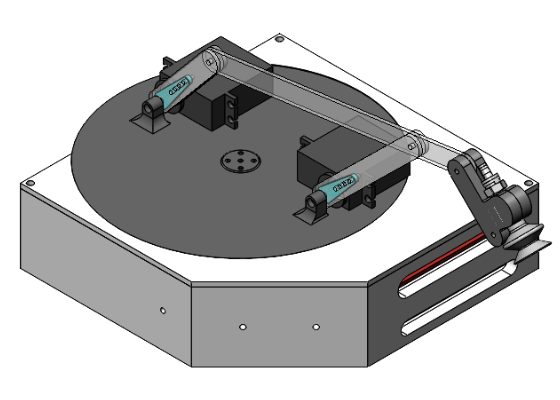

# R.O.D.G.E  - an object sorting robot

    
    
 

---

We are a group of 6 undergraduate students who undertook this project as part of our classwork. This repository serves as the wholistic documentation of our work.

 

The ***cad*** folder stores our models, sketches, and drawings. Most of the files cannot be previewed given the file type; please download the folder in its entirety to view our model. When opening *main.SLDASM*, a dialog boss prompting to locate a file will appear; Choose to suppress it.

 

The ***lcd*** folder stores the libraries and code we used to display the robot's operation status.

 

The ***media*** folder contains a video demonstrating the robot sorting and other documentation.

 

The ***reports*** folder stores our project reports, as requried by our classes. Please refer to these for a detailed understanding of our design and build. While one report focuses on the mechanical aspects of the robot, the other focuses on the software and code of it. The color sorting code can be found here.

 

The ***test-or-calibration*** folder stores smaller parts of the code that were used to test and calibrate individual components.

 

Regards,
 
Rajeev Thimmareddy
 
Clarence Choi
 
Kenny Nguyen
 
Joe Wan
 
Joseph Tai
 
Melissa Zhang